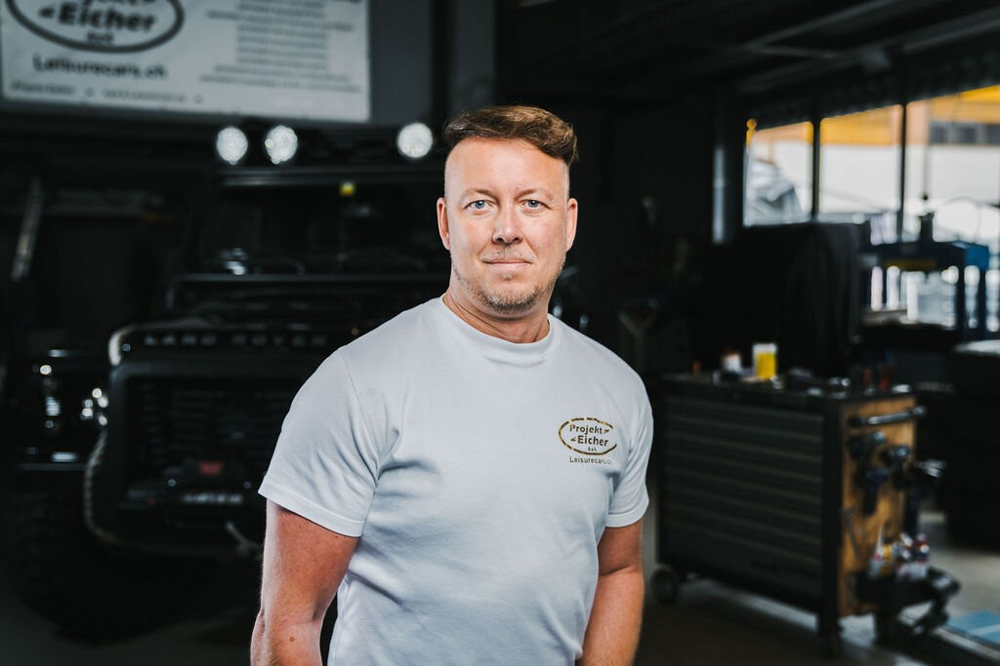

+++
title = "Die Erfolgsgeschichte zu zwei Jahrzehnten Selbstständigkeit"
date = "2024-06-14"
draft = false
pinned = true
tags = ["Selbständigkeit", "Autogarage"]
image = "thumbnail_img_2651.jpg"
footnotes = "Pascal Künzi ist ein 17-jähriger Schüler des Campus Muristalden und befindet sich momentan im zweiten Gymnasiumjahr. Er ist fasziniert von Autos und möchte einmal sein eigenes Unternehmen gründen."
+++


In einer Welt, in der die Sicherheit eines festen Jobs oft als der einzig vernünftige Weg gilt, wagen nur wenige den Schritt in die Unsicherheit der Selbstständigkeit. Patric Eicher gehört zu diesen wenigen Mutigen und seine Geschichte zeigt deutlich, dass Leidenschaft und Durchhaltevermögen sich durchaus lohnen können.





Vor zwanzig Jahren trifft Patric Eicher eine mutige Entscheidung: Er verlässt die Sicherheit eines Angestelltenverhältnisses, um seinen Traum von einer eigenen Autogarage zu verwirklichen. Heute, mit 45 Jahren, blickt der Unternehmer auf zwei Jahrzehnte Selbstständigkeit zurück. Eicher lebt in der Region Thun und betreibt seine Garage seit fünf Jahren in Uetendorf. Vor seiner Garage parken zahlreiche Land Rover Defender, die seinen Betrieb weithin sichtbar machen.



#### Der Weg in die Selbstständigkeit

Eicher entscheidet sich zur Selbstständigkeit als Reaktion auf wiederholte Konflikte mit seinen Vorgesetzten. Mit der Überzeugung, es besser zu können und eigene Ideen zu verwirklichen, wagt er den Sprung ins kalte Wasser. Der Anfang ist jedoch alles andere als leicht. Eicher startet ohne finanzielle Rücklagen, sogar mit Schulden. Die ersten Jahre sind extrem schwierig, und er muss lernen, dass Disziplin das A und O ist. Erst später wird ihm klar, wie wichtig ein finanzielles Polster ist, um schwierige Zeiten zu überstehen. In den ersten sieben Jahren kämpfte Eicher hart, um sich in der Branche zu etablieren. Bis dahin geht es nur ums Überleben.

#### Erfolg und stetiges Wachstum

Trotz der anfänglichen Schwierigkeiten übertrifft Eicher seine eigenen Erwartungen. Sein wichtigstes Ziel ist es seit Beginn, sich selbst finanzieren zu können, und bald schon kann er auch Gewinne erwirtschaften. Heute ist seine Garage in Uetendorf bei Land Rover Defender Besitzern in der ganzen Schweiz bekannt. Die Schweiz zählt etwa 600.000 Selbstständige, was rund 14% der Erwerbstätigen entspricht. Eicher ist einer von ihnen, und seine Geschichte spiegelt viele der typischen Herausforderungen und Triumphe wider, denen Selbstständige im Alltag begegnen.

> *''Bei einem kleinen Unternehmen geht es leider immer nur um Zahlen.''*
>
> \- Patric Eicher

#### Leben als Unternehmer

Das Leben als Selbstständiger bedeutet für Eicher, dass die Arbeit nie wirklich endet. Sein Job ist ein 24-Stunden-Job. Gedanken und Probleme sind immer präsent, egal ob am Abend vor dem Fernseher oder um 3 Uhr morgens. Trotz der ständigen Belastung bereut er seine Entscheidung nicht und kann sich kein anderes Leben mehr vorstellen. Selbständigkeit  wird schnell zur Gewohnheit und wenn man sich durchsetzen will, muss man auch einiges durchhalten können.

#### Krisenbewältigung und Standhaftigkeit

Eine weitere wichtige Lektion für Eicher ist die finanzielle Verantwortung. In den ersten Jahren begleicht er nach der Arbeit am Freitag stets alle Rechnungen, selbst wenn es bedeutet, dass am Wochenende das Geld knapp wird. Für ihn zählt vor allem, dass alle Rechnungen bezahlt sind. Dieses konsequente Management hilft ihm, auch in schwierigen Zeiten stabil zu bleiben. Als Selbständiger ist es sehr wichtig, die eigenen Finanzen im Griff zu behalten. Eicher empfiehlt einen Treuhänder anzustellen, der einem in jeder Situation behilflich sein kann.

> "Nach der Arbeit am Freitag beglich ich stets alle Rechnungen, selbst wenn es bedeutete, dass am Wochenende das Geld knapp wurde. Doch für mich zählte vor allem, dass alle Rechnungen bezahlt waren."
>
> \-Patric Eicher

#### Rückblick und Zukunftsaussichten

Rückblickend würde Eicher nur wenige Dinge anders machen. Er hat aus seinen Fehlern gelernt und diese Erkenntnisse genutzt, um sein Unternehmen kontinuierlich zu verbessern.  Durch die stetige Weiterentwicklung seines Unternehmens und die Anpassung an neue Technologien und Kundenbedürfnisse ist er zuversichtlich, weiterhin erfolgreich zu sein. Besonders wichtig ist ihm dabei, die Qualität seiner Dienstleistungen hochzuhalten, um schweizweit einen hohen Standard zu schaffen und gleichzeitig wirtschaftlich zu bleiben.  Trotz der Herausforderungen, die mit dem Wandel in der Automobilindustrie kommen, bleibt Eicher seiner Leidenschaft fürs Schrauben treu und sieht auch in Zukunft Chancen für weiteres Wachstum und Erfolg.

Patric Eichers Geschichte ist ein inspirierendes Beispiel für die Entschlossenheit und den Willen, die es braucht, um als Selbstständiger erfolgreich zu sein. In einer Zeit, in der immer mehr Menschen den Schritt in die Selbstständigkeit wagen, zeigt Eicher, dass es möglich ist, trotz aller Widrigkeiten langfristig Erfolg zu haben.