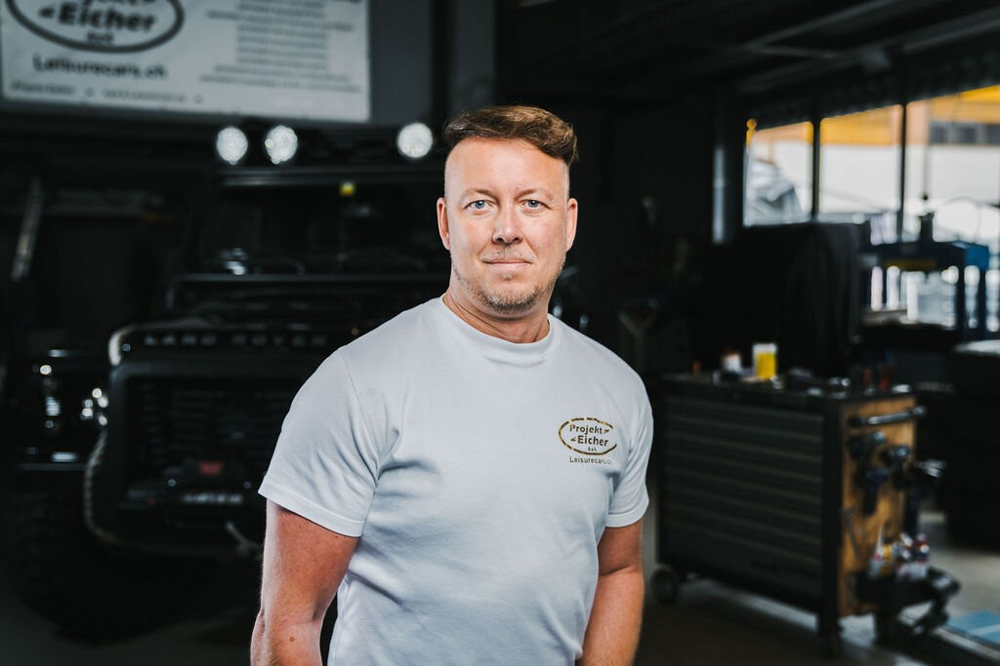

+++
title = "Selbstständig zum Erfolg"
date = "2024-06-04"
draft = false
pinned = true
tags = ["Autogarage", "Selbständigkeit"]
image = "thumbnail_img_2651.jpg"
+++


Vor 20 Jahren wagte Patric Eicher den Schritt in die Selbstständigkeit und eröffnete seine eigene Autogarage. Im Interview spricht er über die Herausforderungen, seine Beweggründe und gibt sogar Tipps.





Patric Eicher, welcher in der Region Thun wohnt, ist 45 Jahre alt und seit 20 Jahren besitzt er eine eigene Garage. Seit etwa 5 Jahren befindet sich seine Garage in Uetendorf und ist durch die grosse Anzahl von Land Rover Defender, welche zur Ausschau direkt an der Strasse stehen, ohne Probleme erkennbar.



**Warum haben Sie sich dazu entschieden, selbstständig zu werden?**

Es war schon immer schwierig mit meinen damaligen Vorgesetzten. Mein letzter Vorgesetzter hat mir am Schluss mitgeteilt, dass ich ein Autoritätsproblem habe. Das wollte ich nicht mehr. Ich dachte, dass ich das besser kann und mein eigener Chef sein kann, um keine Zeit für Dinge zu verschwenden, die sowieso nicht funktionieren.

**Was muss man beachten, wenn man sich selbstständig machen möchte?**

Ganz wichtig ist Disziplin. Und was ich erst später festgestellt habe, ist, dass man einen gewissen finanziellen Hintergrund haben muss, also Erspartes oder eine Rücklage, um eine gewisse Sicherheit für schwierige Situationen zu haben. Ich habe mit null oder sogar mit minus angefangen, und die ersten Jahre waren wirklich schwierig.

**Was waren Ihre Erwartungen, als Sie sich selbstständig gemacht haben?**

Mein Ziel war zu Anfang, dass ich sicher mich selbst finanzieren kann, und das hat eigentlich auch funktioniert. Die Erwartungen habe ich später dann wirklich übertroffen. Ich habe nicht erwartet, dass es so lange so gut gehen würde.

> *''Bei einem kleinen Unternehmen geht es leider immer nur um Zahlen.''*
>
> \- Patric Eicher

**Wie hat sich Ihr Leben verändert, seit Sie selbstständig sind?**

Mein Leben hat sich insofern verändert, dass ich nicht um 17:00 Uhr Feierabend habe und danach Freizeit. Mein Job ist ein 24-Stunden-Job. Die Gedanken und Probleme sind immer präsent, egal ob am Abend vor dem Fernseher oder um 3 Uhr morgens. Trotzdem bereue ich es nicht und kann mir kein anderes Leben mehr vorstellen.

**Wie lange hat es gedauert, bis Sie sich etabliert hatten?**

Es dauerte etwa sieben Jahre, bis ich mich in der Branche etabliert hatte. Die ersten sieben Jahre waren ein Kampf. Ich musste lernen, dass es immer um die Zahlen geht. Diese Erkenntnis hat mir geholfen, mich auf die profitabelsten Aufgaben zu konzentrieren.

**Was hätten Sie getan, wenn Ihre Firma gescheitert wäre?**

Hätte meine Firma nicht funktioniert, hätte ich mich wahrscheinlich wieder irgendwo anstellen lassen. Der Aufbau meines Unternehmens kostete so viel Energie, dass ich mir nur eine Chance geben konnte. Mein oberstes Ziel war es stets, keine Schulden anzuhäufen und alle Rechnungen pünktlich zu bezahlen, auch wenn das bedeutete, am Wochenende kein Geld mehr übrig zu haben.

> "Nach der Arbeit am Freitag beglich ich stets alle Rechnungen, selbst wenn es bedeutete, dass am Wochenende das Geld knapp wurde. Doch für mich zählte vor allem, dass alle Rechnungen bezahlt waren."
>
> \-Pascal Künzi

**Würden Sie heute etwas anders machen?**

Rückblickend würde ich nur wenige Dinge anders machen. Ich habe aus meinen Fehlern gelernt und diese Erkenntnisse genutzt, um mein Unternehmen kontinuierlich zu verbessern. Trotz der Herausforderungen sehe ich optimistisch in die Zukunft und bleibe meiner Leidenschaft fürs schrauben treu.